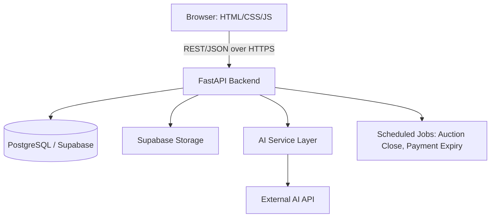
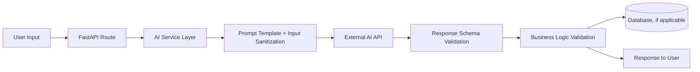

# Auction Hub — Technical Requirement Documentation

## 1. Technology Stack

| Layer | Technology |
|---|---|
| Frontend | HTML, CSS, JavaScript (vanilla) |
| Backend | Python, FastAPI |
| Database | PostgreSQL (via Supabase) |
| Storage | Supabase Storage (product images) |
| AI | External AI API, called only from the backend |
| Auth | JWT-based session auth, issued by FastAPI |
| Background jobs | FastAPI background tasks / scheduled worker for auction close + payment window expiry |

No React, Node.js, or MongoDB is introduced. The requested stack is sufficient for this project's scale; the only addition beyond the explicit request is a lightweight scheduled-job mechanism (needed for auction auto-close — this cannot be done from the frontend, since the frontend is explicitly untrusted for auction decisions).

## 2. System Architecture (High Level)

## 3. Frontend Architecture

- Static HTML pages per major view (home, product detail, auction detail, dashboards, checkout).
- Shared `api.js` module wrapping `fetch()` calls to the backend; no AI keys, DB credentials, or storage keys ever present client-side.
- Vanilla JS component-style modules per page (e.g., `auction.js` handles countdown + bid form + polling for bid updates).
- Auction pages poll `GET /api/auctions/{id}` every few seconds for live bid state (documented WebSocket upgrade path in Section 9).

## 4. Backend Architecture

Layered FastAPI app: routes → services → repositories → database. See `07_Backend_Schema.md` for full folder structure and per-service responsibilities. Key principle: **routes contain no business logic**; all business rules (bid validation, auction closing, non-payment cascade) live in services, are unit-testable independent of HTTP, and are the only layer allowed to mutate critical state.

## 5. Database Architecture

PostgreSQL via Supabase. Full schema in `05_Schema.md`. Key architectural decisions:
- Bid placement uses `SELECT ... FOR UPDATE` on the auction row inside a transaction to serialize concurrent bids safely.
- Status fields (`listing_status`, `auction_status`, `order_status`) are constrained via `CHECK` constraints or Postgres enums, not free text.
- All money fields use `NUMERIC(12,2)`, never floating point.

## 6. AI Architecture

- Each AI feature has a dedicated function in `ai_service.py` with its own prompt template and expected JSON output schema.
- All AI responses are parsed as JSON and validated against a Pydantic schema before use — an AI response that doesn't validate is treated as a failure, triggering the fallback path, never passed through raw.
- AI is never given direct database or tool-execution access; it receives only the specific data fields relevant to the feature (e.g., product attributes, not raw SQL access).
- Every AI call is logged to `ai_interactions` (feature, input summary, output, latency, success/failure) for auditability and future ML training data collection.
- Provider abstraction: `ai_service.py` exposes feature-level functions (`get_search_filters()`, `get_listing_draft()`, etc.) that internally call a swappable `ai_client` — changing providers means changing one client module, not every call site.

## 7. API Architecture

REST/JSON over HTTPS. Full endpoint list and contracts in `07_Backend_Schema.md`. Auth via `Authorization: Bearer <JWT>` header. All mutating endpoints require authentication; ownership checks (e.g., "is this the listing's seller?") enforced server-side on every write.

## 8. Authentication

- Registration: email + password (hashed with bcrypt), or optional future OAuth.
- Login issues a short-lived JWT access token; refresh token pattern used for session longevity.
- `GET /api/auth/me` used by frontend to hydrate user state on page load.
- Role checks (`admin`) enforced via a FastAPI dependency, not client-side flags.

## 9. Storage

Product images uploaded directly from the browser to Supabase Storage using a short-lived signed upload URL issued by the backend (never exposing the storage service key to the client). Backend validates file type/size before issuing the signed URL and again on a post-upload webhook/confirmation.

## 10. Performance

- Pagination on all list endpoints (`/api/products`, `/api/auctions`) — never return unbounded result sets.
- Indexes on frequently filtered/sorted columns (category, price, auction end time, created_at) — see `05_Schema.md`.
- AI calls run with an explicit timeout (e.g., 8s) and are never in the critical path of a purchase or bid — they're additive/advisory endpoints only.

## 11. Scalability

- Stateless FastAPI instances (JWT auth, no server-side session state) allow straightforward horizontal scaling if ever needed.
- Auction bid contention is scoped to a single auction row lock, so load on one popular auction doesn't degrade unrelated auctions.
- Current scale (student project) doesn't warrant caching layers or message queues; documented as a Phase-2/production concern, not built now, to avoid over-engineering.

## 12. Error Handling

- Standardized error response shape: `{ "error": { "code": str, "message": str } }`.
- AI failures caught explicitly and mapped to a defined fallback (see `03_AppFlow.md`, AI Failure/Fallback Flow) rather than surfaced as a generic 500 to the user.
- Auction/bid validation failures return specific error codes (e.g., `BID_TOO_LOW`, `AUCTION_ENDED`, `NOT_ELIGIBLE`) so the frontend can show precise messaging.

## 13. Logging

- Structured logging (JSON lines) for all requests, with request ID correlation.
- Separate audit log for: admin actions, auction closes, payment events, AI trust/safety flags — these are compliance/accountability-sensitive and retained longer than general request logs.

## 14. Monitoring

- Basic health check endpoint (`GET /health`) verifying DB connectivity.
- AI service failure rate tracked (even a simple counter/log-based metric is sufficient at this scale) so repeated AI outages are visible rather than silently degrading UX.

## 15. Deployment

- Backend: any standard ASGI-compatible host (e.g., Render, Railway, Fly.io) running Uvicorn/FastAPI.
- Database/Storage: Supabase-managed.
- Frontend: static hosting (Supabase, Netlify, Vercel static, or served directly by FastAPI as static files) — no build step required since plain HTML/CSS/JS is used.
- Environment variables (DB URL, JWT secret, AI API key, storage keys) injected via host-level env config, never committed to source control.

## 16. AI API Integration

- Backend-only integration; frontend never sees the AI API key.
- All AI provider calls wrapped with retry-once-on-transient-failure, then fallback.
- Prompts are templated server-side; user input is inserted as data into the template, not concatenated as raw instructions, reducing prompt-injection surface (see `06_Security.md`).

## 17. Future ML Integration

The AI service layer's function-level abstraction (e.g., `get_price_guidance()`) means a future custom ML model can be swapped in behind the same function signature without touching routes or frontend code. See `08_Implementation_Plan.md`, Future ML Model section, for the full data pipeline plan.
