# Auction Hub — Application Flow

## 1. Overall Application Flow

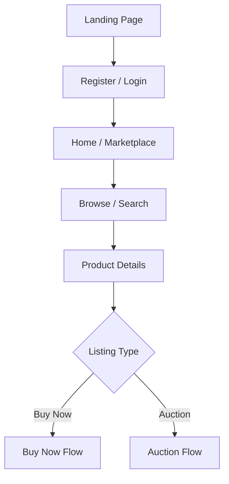

## 2. Buyer Flow

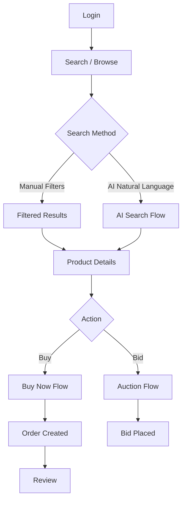

## 3. Seller Flow

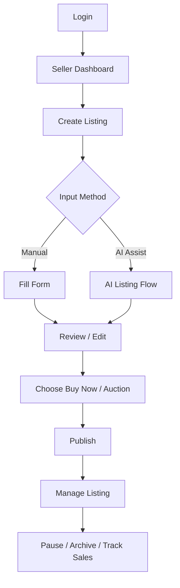

## 4. Admin Flow

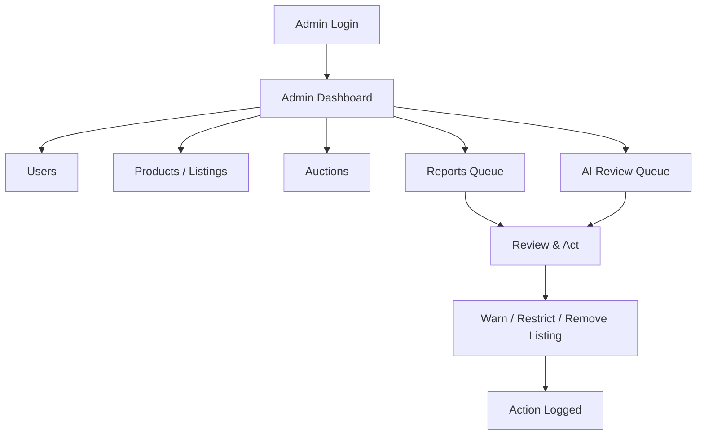

## 5. Buy Now Flow

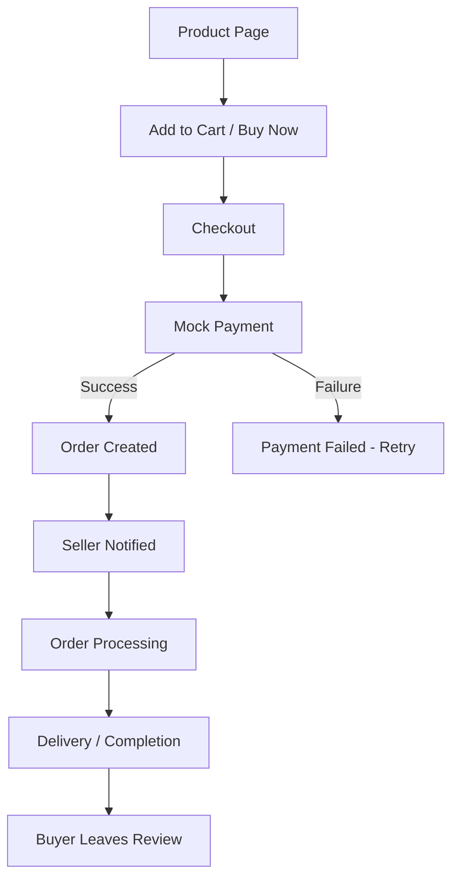

## 6. Auction Flow

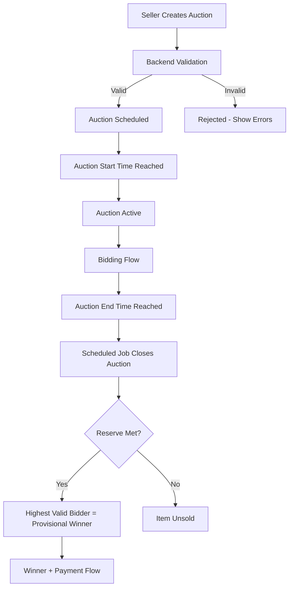

## 7. Bidding Flow

```mermaid
sequenceDiagram
    participant U as User (Browser)
    participant API as FastAPI
    participant DB as PostgreSQL

    U->>API: POST /api/auctions/{id}/bids {amount}
    API->>API: Verify auth, auction status, timing
    API->>DB: BEGIN; SELECT auction FOR UPDATE
    DB-->>API: Current highest bid
    API->>API: Validate amount >= highest + min_increment
    alt Valid
        API->>DB: INSERT bid, UPDATE auction.current_bid
        API->>DB: COMMIT
        API-->>U: 201 Bid Accepted
        API->>API: Notify previous highest bidder (outbid)
    else Invalid
        API->>DB: ROLLBACK
        API-->>U: 400 Error (BID_TOO_LOW / AUCTION_ENDED / etc.)
    end
```

## 8. Auction Completion Flow

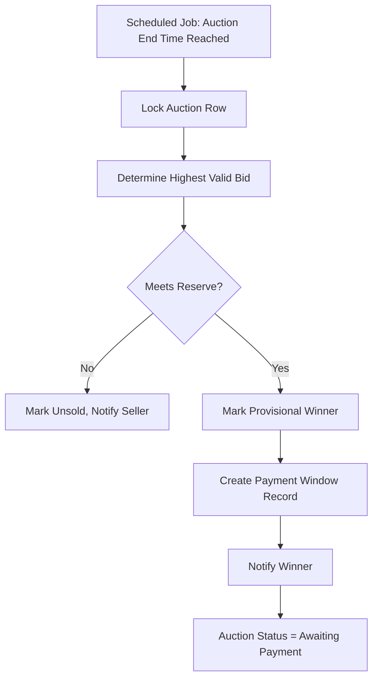

## 9. Non-Payment Flow

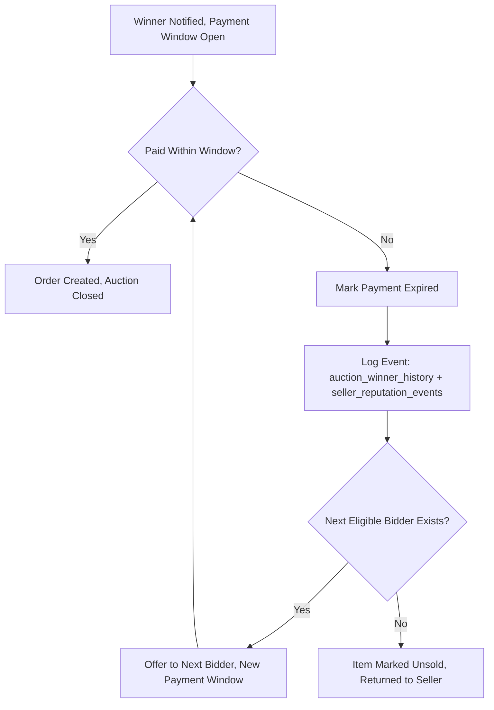

## 10. AI Natural Search Flow

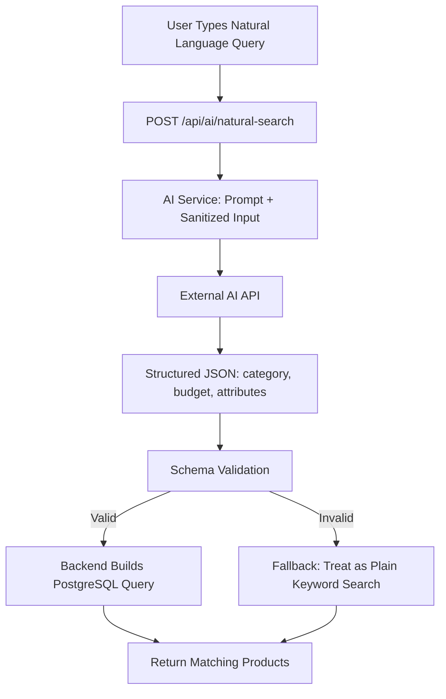

## 11. AI Listing Flow

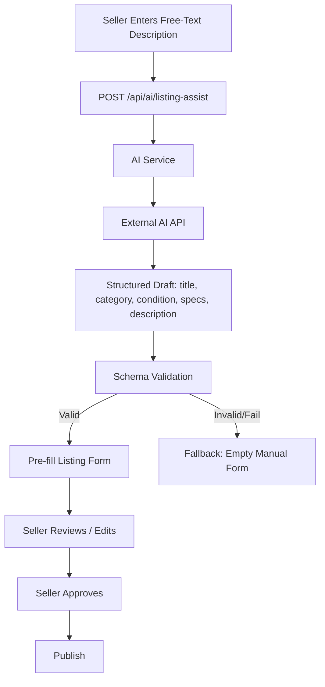

## 12. AI Price Guidance Flow

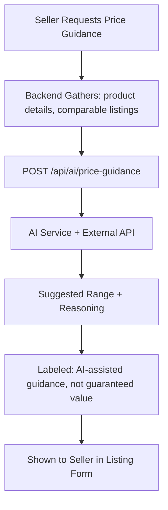

## 13. AI Auction Assistant Flow

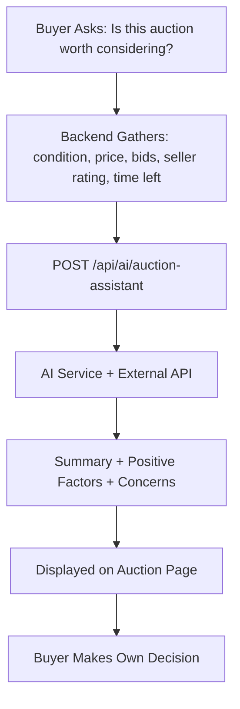

## 14. AI Review Summary Flow (Phase 2)

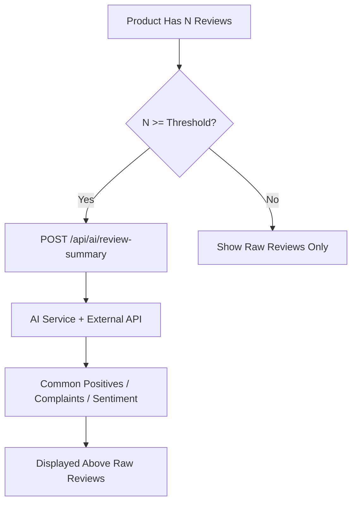

## 15. AI Trust Flow

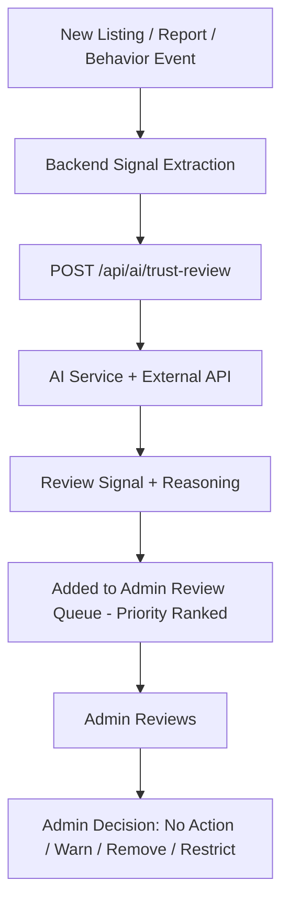

## 16. AI Image Flow (Phase 2)

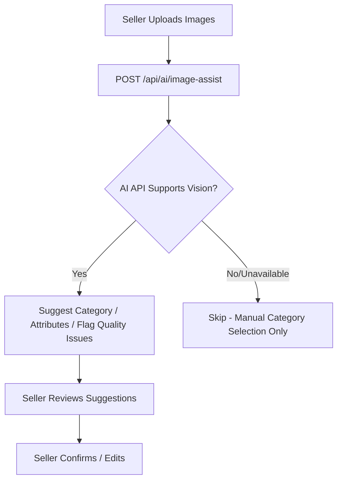

## 17. AI Failure / Fallback Flow

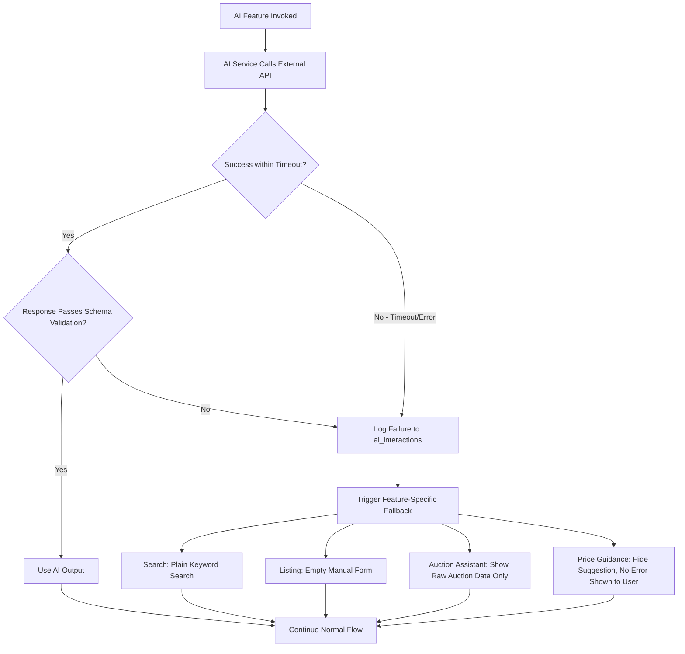

**Principle:** no core transaction (buy, bid, publish) is ever blocked by an AI failure. AI failures degrade the experience, never break it.
