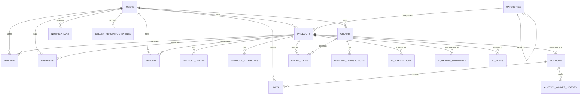

# Auction Hub — Database Schema (PostgreSQL / Supabase)

## 1. Entity Relationship Overview

## 2. Core Tables

### 2.1 `users`
| Column | Type | Constraints |
|---|---|---|
| id | UUID | PK, default gen_random_uuid() |
| email | TEXT | UNIQUE, NOT NULL |
| password_hash | TEXT | NOT NULL |
| full_name | TEXT | NOT NULL |
| phone | TEXT | NULLABLE |
| role | TEXT | NOT NULL, CHECK (role IN ('user','admin')), DEFAULT 'user' |
| account_status | TEXT | NOT NULL, CHECK (account_status IN ('active','restricted','suspended')), DEFAULT 'active' |
| avg_rating | NUMERIC(3,2) | DEFAULT 0, denormalized from reviews for read performance |
| created_at | TIMESTAMPTZ | NOT NULL, DEFAULT now() |
| updated_at | TIMESTAMPTZ | NOT NULL, DEFAULT now() |

### 2.2 `seller_profiles`
| Column | Type | Constraints |
|---|---|---|
| user_id | UUID | PK, FK → users.id |
| display_name | TEXT | NULLABLE |
| bio | TEXT | NULLABLE |
| location | TEXT | NULLABLE |
| total_sales | INTEGER | DEFAULT 0 |
| created_at | TIMESTAMPTZ | DEFAULT now() |

*Note: a row is created lazily the first time a user publishes their first listing — every user is potentially a seller, so this is not a required signup-time table.*

### 2.3 `categories`
| Column | Type | Constraints |
|---|---|---|
| id | UUID | PK |
| name | TEXT | NOT NULL |
| slug | TEXT | UNIQUE, NOT NULL |
| parent_id | UUID | FK → categories.id, NULLABLE (NULL = top-level category) |
| created_at | TIMESTAMPTZ | DEFAULT now() |

Index: `(parent_id)` for subcategory lookups.

### 2.4 `products`
| Column | Type | Constraints |
|---|---|---|
| id | UUID | PK |
| seller_id | UUID | FK → users.id, NOT NULL |
| category_id | UUID | FK → categories.id, NOT NULL |
| title | TEXT | NOT NULL |
| brand | TEXT | NULLABLE |
| model | TEXT | NULLABLE |
| condition | TEXT | NOT NULL, CHECK (condition IN ('new','like_new','good','fair','poor')) |
| product_age_months | INTEGER | NULLABLE |
| original_price | NUMERIC(12,2) | NULLABLE |
| listing_type | TEXT | NOT NULL, CHECK (listing_type IN ('buy_now','auction')) |
| price | NUMERIC(12,2) | NULLABLE — required if listing_type = 'buy_now' (enforced at app layer) |
| description | TEXT | NOT NULL |
| location | TEXT | NULLABLE |
| accessories_included | TEXT | NULLABLE |
| defects_notes | TEXT | NULLABLE |
| warranty_info | TEXT | NULLABLE |
| listing_status | TEXT | NOT NULL, CHECK (listing_status IN ('draft','published','paused','archived','removed')), DEFAULT 'draft' |
| created_at | TIMESTAMPTZ | DEFAULT now() |
| updated_at | TIMESTAMPTZ | DEFAULT now() |

Indexes: `(category_id)`, `(seller_id)`, `(listing_status)`, `(listing_type)`, composite `(category_id, listing_status, price)` for common browse queries.

### 2.5 `product_images`
| Column | Type | Constraints |
|---|---|---|
| id | UUID | PK |
| product_id | UUID | FK → products.id, NOT NULL, ON DELETE CASCADE |
| storage_path | TEXT | NOT NULL (Supabase Storage path) |
| display_order | SMALLINT | NOT NULL, DEFAULT 0 |
| created_at | TIMESTAMPTZ | DEFAULT now() |

### 2.6 `product_attributes`
Flexible key-value store for category-specific specs (e.g., RAM, storage, size) without a rigid per-category schema.
| Column | Type | Constraints |
|---|---|---|
| id | UUID | PK |
| product_id | UUID | FK → products.id, NOT NULL, ON DELETE CASCADE |
| attribute_key | TEXT | NOT NULL |
| attribute_value | TEXT | NOT NULL |

Index: `(product_id)`.

### 2.7 `auctions`
| Column | Type | Constraints |
|---|---|---|
| id | UUID | PK |
| product_id | UUID | FK → products.id, UNIQUE, NOT NULL |
| starting_bid | NUMERIC(12,2) | NOT NULL |
| min_increment | NUMERIC(12,2) | NOT NULL |
| reserve_price | NUMERIC(12,2) | NULLABLE |
| current_bid | NUMERIC(12,2) | NULLABLE |
| current_highest_bidder_id | UUID | FK → users.id, NULLABLE |
| bid_count | INTEGER | NOT NULL, DEFAULT 0 |
| start_time | TIMESTAMPTZ | NOT NULL |
| end_time | TIMESTAMPTZ | NOT NULL |
| auction_status | TEXT | NOT NULL, CHECK (auction_status IN ('scheduled','active','closed_sold','closed_unsold','awaiting_payment')), DEFAULT 'scheduled' |
| created_at | TIMESTAMPTZ | DEFAULT now() |

Indexes: `(auction_status, end_time)` — critical for the scheduled-close job to efficiently find auctions to close. `(product_id)` unique.

### 2.8 `bids`
| Column | Type | Constraints |
|---|---|---|
| id | UUID | PK |
| auction_id | UUID | FK → auctions.id, NOT NULL |
| bidder_id | UUID | FK → users.id, NOT NULL |
| amount | NUMERIC(12,2) | NOT NULL |
| created_at | TIMESTAMPTZ | NOT NULL, DEFAULT now() |

Index: `(auction_id, amount DESC, created_at)` for fast highest-bid / history lookups. Bids are **append-only** (never updated/deleted) to preserve a full audit trail.

### 2.9 `auction_winner_history`
Tracks the winner-cascade sequence for a single auction (supports the non-payment reassignment workflow and gives a full audit trail).
| Column | Type | Constraints |
|---|---|---|
| id | UUID | PK |
| auction_id | UUID | FK → auctions.id, NOT NULL |
| bidder_id | UUID | FK → users.id, NOT NULL |
| sequence_number | SMALLINT | NOT NULL — 1 = first offered winner, 2 = next eligible, etc. |
| offered_at | TIMESTAMPTZ | NOT NULL, DEFAULT now() |
| payment_deadline | TIMESTAMPTZ | NOT NULL |
| outcome | TEXT | NOT NULL, CHECK (outcome IN ('pending','paid','expired','declined')), DEFAULT 'pending' |

Index: `(auction_id, sequence_number)`.

### 2.10 `orders`
| Column | Type | Constraints |
|---|---|---|
| id | UUID | PK |
| buyer_id | UUID | FK → users.id, NOT NULL |
| order_type | TEXT | NOT NULL, CHECK (order_type IN ('buy_now','auction')) |
| total_amount | NUMERIC(12,2) | NOT NULL |
| order_status | TEXT | NOT NULL, CHECK (order_status IN ('placed','processing','shipped','completed','cancelled')), DEFAULT 'placed' |
| created_at | TIMESTAMPTZ | DEFAULT now() |
| updated_at | TIMESTAMPTZ | DEFAULT now() |

### 2.11 `order_items`
| Column | Type | Constraints |
|---|---|---|
| id | UUID | PK |
| order_id | UUID | FK → orders.id, NOT NULL, ON DELETE CASCADE |
| product_id | UUID | FK → products.id, NOT NULL |
| seller_id | UUID | FK → users.id, NOT NULL (denormalized for fast seller-side order queries) |
| price | NUMERIC(12,2) | NOT NULL |

### 2.12 `payment_transactions`
Added beyond the original list — needed to make payment attempts (including the auction non-payment cascade) auditable rather than inferred from order status alone.
| Column | Type | Constraints |
|---|---|---|
| id | UUID | PK |
| order_id | UUID | FK → orders.id, NULLABLE (nullable until order exists, for auction payment-window attempts) |
| auction_id | UUID | FK → auctions.id, NULLABLE |
| user_id | UUID | FK → users.id, NOT NULL |
| amount | NUMERIC(12,2) | NOT NULL |
| status | TEXT | NOT NULL, CHECK (status IN ('pending','success','failed','expired')) |
| provider | TEXT | NOT NULL, DEFAULT 'mock' — swappable to real gateway name later |
| created_at | TIMESTAMPTZ | DEFAULT now() |

### 2.13 `wishlists`
| Column | Type | Constraints |
|---|---|---|
| id | UUID | PK |
| user_id | UUID | FK → users.id, NOT NULL |
| product_id | UUID | FK → products.id, NOT NULL |
| created_at | TIMESTAMPTZ | DEFAULT now() |

Unique constraint: `(user_id, product_id)`.

### 2.14 `reviews`
| Column | Type | Constraints |
|---|---|---|
| id | UUID | PK |
| order_id | UUID | FK → orders.id, NOT NULL |
| reviewer_id | UUID | FK → users.id, NOT NULL |
| product_id | UUID | FK → products.id, NOT NULL |
| seller_id | UUID | FK → users.id, NOT NULL |
| rating | SMALLINT | NOT NULL, CHECK (rating BETWEEN 1 AND 5) |
| comment | TEXT | NULLABLE |
| created_at | TIMESTAMPTZ | DEFAULT now() |

Unique constraint: `(order_id, reviewer_id)` — one review per completed order.

### 2.15 `notifications`
| Column | Type | Constraints |
|---|---|---|
| id | UUID | PK |
| user_id | UUID | FK → users.id, NOT NULL |
| type | TEXT | NOT NULL, CHECK (type IN ('outbid','auction_won','payment_window','order_status','ai_flag_admin','report_update')) |
| message | TEXT | NOT NULL |
| related_entity_id | UUID | NULLABLE |
| is_read | BOOLEAN | NOT NULL, DEFAULT false |
| created_at | TIMESTAMPTZ | DEFAULT now() |

Index: `(user_id, is_read, created_at DESC)`.

### 2.16 `reports`
| Column | Type | Constraints |
|---|---|---|
| id | UUID | PK |
| reporter_id | UUID | FK → users.id, NOT NULL |
| target_type | TEXT | NOT NULL, CHECK (target_type IN ('product','user')) |
| target_id | UUID | NOT NULL |
| reason | TEXT | NOT NULL |
| description | TEXT | NULLABLE |
| status | TEXT | NOT NULL, CHECK (status IN ('open','reviewed','resolved','dismissed')), DEFAULT 'open' |
| created_at | TIMESTAMPTZ | DEFAULT now() |

### 2.17 `seller_reputation_events`
Added beyond the original list — an append-only event log (not just a mutable score) so reputation actions are explainable and auditable, and support the non-payment escalation policy.
| Column | Type | Constraints |
|---|---|---|
| id | UUID | PK |
| user_id | UUID | FK → users.id, NOT NULL |
| event_type | TEXT | NOT NULL, CHECK (event_type IN ('non_payment','positive_review','negative_review','admin_warning','admin_restriction')) |
| related_entity_id | UUID | NULLABLE |
| created_at | TIMESTAMPTZ | DEFAULT now() |

## 3. AI-Related Tables

### 3.1 `ai_interactions`
Generic log of every AI feature call — audit trail and future ML training data source.
| Column | Type | Constraints |
|---|---|---|
| id | UUID | PK |
| user_id | UUID | FK → users.id, NULLABLE |
| feature | TEXT | NOT NULL, CHECK (feature IN ('search','listing_assist','price_guidance','auction_assistant','review_summary','trust_review','image_assist','product_compare','seller_insights','faq')) |
| input_summary | JSONB | NOT NULL |
| output_summary | JSONB | NULLABLE |
| status | TEXT | NOT NULL, CHECK (status IN ('success','failed','timeout','invalid_response')) |
| latency_ms | INTEGER | NULLABLE |
| created_at | TIMESTAMPTZ | DEFAULT now() |

Index: `(feature, created_at)`.

### 3.2 `ai_review_summaries`
| Column | Type | Constraints |
|---|---|---|
| id | UUID | PK |
| product_id | UUID | FK → products.id, UNIQUE, NOT NULL |
| summary_text | TEXT | NOT NULL |
| positives | JSONB | NULLABLE |
| complaints | JSONB | NULLABLE |
| review_count_at_generation | INTEGER | NOT NULL |
| generated_at | TIMESTAMPTZ | DEFAULT now() |

*Regenerated periodically (e.g., every N new reviews), not on every page load.*

### 3.3 `ai_flags`
| Column | Type | Constraints |
|---|---|---|
| id | UUID | PK |
| target_type | TEXT | NOT NULL, CHECK (target_type IN ('product','user')) |
| target_id | UUID | NOT NULL |
| reason | TEXT | NOT NULL |
| signal_details | JSONB | NULLABLE |
| review_status | TEXT | NOT NULL, CHECK (review_status IN ('pending','reviewed_ok','reviewed_action_taken')), DEFAULT 'pending' |
| reviewed_by_admin_id | UUID | FK → users.id, NULLABLE |
| created_at | TIMESTAMPTZ | DEFAULT now() |

Index: `(review_status, created_at)` — feeds the admin review queue.

## 4. Relationships Summary

- A `user` can own many `products` (as seller), place many `bids`, create many `orders` (as buyer).
- A `product` optionally has exactly one `auctions` row (1:1) if `listing_type = 'auction'`.
- An `auction` has many `bids`; the current highest is denormalized onto `auctions.current_bid` / `current_highest_bidder_id` for fast reads, with `bids` remaining the source of truth.
- An `order` has many `order_items`, each referencing one `product`.
- `ai_interactions` is a general-purpose log referenced loosely (not FK-bound to every possible target) to keep it lightweight and feature-agnostic.

## 5. Future ML Data Requirements

For a future price-prediction model, the schema already captures the needed training signal without modification: `products` (category, brand, condition, age, original_price), `auctions` (starting_bid, final `current_bid`, bid_count, duration from start/end_time), `users`/`seller_profiles` (seller rating), and `ai_interactions`/`auction_winner_history` (outcome labels). See `08_Implementation_Plan.md` for the full future-ML pipeline.
